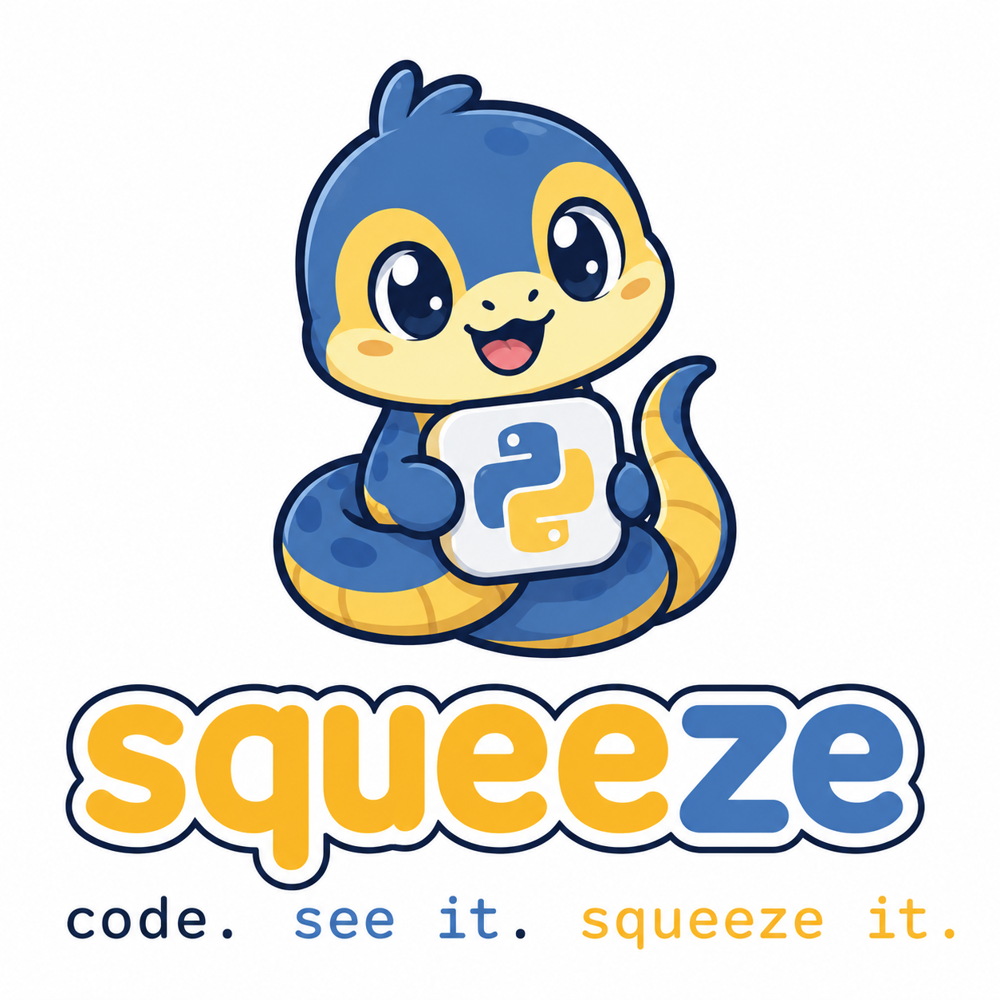

<p align="center">
  
</p>

<h1 align="center">Squeeze</h1>

<p align="center">
  <strong>code. see it. squeeze it.</strong><br />
  A visual coding editor where Scratch blocks and real Python stay in sync.
</p>

<p align="center">
  <a href="#quick-start">Quick start</a> ·
  <a href="#features">Features</a> ·
  <a href="#docker">Docker</a> ·
  <a href="#license">License</a>
</p>

---

## What is Squeeze?

**Squeeze** is a self-hosted coding playground built on [TurboWarp](https://turbowarp.org/) (Scratch 3.0). Drag blocks, write Python, run it on the stage — and keep both views aligned.

- **Blocks → Python** — import a sprite’s scripts into the editor
- **Python → blocks** — edits in the Python panel update the block workspace
- **Run for real** — execute Python on the stage via Pyodide and a Scratch API bridge

No installs for students: everything runs in the browser.

## Features

| | |
|---|---|
| 🧩 **Familiar blocks** | Full Scratch-style editor (motion, looks, control, variables, lists, …) |
| 🐍 **Real Python** | Monaco editor with Squeeze-specific autocomplete (`sprite.`, events, project costumes/sounds) |
| ↔️ **Two-way sync** | Python and blocks stay aligned as you work |
| 📦 **Scripts library** | Save and reuse Python snippets |
| 💾 **Projects with Python** | Sprite code is stored inside `.sb3` project files |
| 🚀 **Self-hosted** | Dev server, Docker, or Kubernetes — your infrastructure |

## Quick start

**Requirements:** [Node.js 24](https://nodejs.org/) (see `.nvmrc`)

```bash
nvm use
npm install --ignore-scripts
npm start
```

Open **http://localhost:8601**

### Optional: offline Pyodide

```bash
npm run download-pyodide
```

Downloads Pyodide v0.26.0 into `public/pyodide/` for environments without CDN access.

## Docker

```bash
export DOCKER_HUB_PERSONAL_TOKEN="your-token"   # optional — Hub rate limits
export DOCKER_HUB_USERNAME="alexiscaspell"        # optional
npm run docker:up
```

Open **http://localhost:3000**

Or manually:

```bash
docker compose up -d --build
```

### Pull from Docker Hub

Images are published as **`alexiscaspell/squeeze`** on push to `main` (GitHub Actions).

```bash
docker pull alexiscaspell/squeeze:latest
docker run -p 3000:80 alexiscaspell/squeeze:latest
```

**CI setup:** add a repository secret named `DOCKER_TOKEN` (Docker Hub access token with read/write).

### Docker DNS issues?

If pulls fail with `lookup registry-1.docker.io ... server misbehaving`, that is a local DNS/network problem — not a missing token. Try restarting DNS (`systemd-resolved`) or pointing Docker at public DNS (`8.8.8.8`, `1.1.1.1`) in `/etc/docker/daemon.json`.

## Kubernetes

```bash
# Edit host/TLS in k8s/ingress.yaml first
kubectl apply -f k8s/
```

Pyodide needs **COOP/COEP** headers (included in the bundled nginx config).

## Project layout

```
squeeze/
├── assets/branding/     # logo.png, textlogo.png (source of truth)
├── src/                 # Squeeze Python runtime, editor, VM bridge
├── packages/scratch-gui # TurboWarp UI (fork)
├── docker/              # Production nginx image
└── k8s/                 # Deployment manifests
```

## Branding

Logo files live in **`assets/branding/`**:

- **`logo.png`** — mascot + wordmark (splash, homepage, favicon)
- **`textlogo.png`** — wordmark only (menu bar)

See [assets/branding/README.md](assets/branding/README.md) for how they are wired into the build.

## License

GPL-3.0 — inherits from TurboWarp / Scratch ecosystem.

<p align="center">
  <sub>Built with 🐍 on TurboWarp · Not affiliated with Scratch or the Scratch Foundation</sub>
</p>
